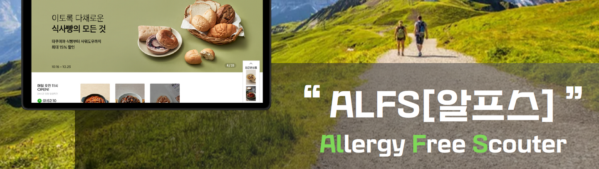

# 알러지 정보 기반의 온라인 식료품 쇼핑 플랫폼

### 프로젝트 개발 기간

`2023.10.10.` ~ `2023.11.17.` (6주)

<br>

### 시연 영상

> https://youtu.be/nYTkQnfxt8Q

<br>

### 목차

- [기술 스택](#-기술-스택)
- [서비스 소개](#-서비스-소개)
- [데모](#-데모)
- [기능 소개](#-기능-소개)
  * [주요 기능](#주요-기능)
  * [&#128106; 실행 화면 (일반회원)](#-실행-화면-일반회원)
    + [메인페이지](#메인페이지)
    + [마이페이지 - 알러지 관리](#마이페이지---알러지-관리)
    + [상품 조회](#상품-조회)
    + [대체상품 조회](#대체상품-조회)
    + [특가할인 페이지](#특가할인-페이지)
    + [장바구니](#장바구니)
    + [마이페이지 - 배송지 관리](#마이페이지---배송지-관리)
    + [이벤트 페이지](#이벤트-페이지)
    + [고객 센터 1:1 문의](#고객-센터-11-문의)
  * [&#128119; 실행 화면 (관리자)](#-실행-화면-관리자)
    + [관리자 로그인](#관리자-로그인)
    + [상품등록](#상품등록)
    + [상품관리](#상품관리)
    + [특가상품](#특가상품)
    + [문의내역 관리](#문의내역-관리)
- [산출물](#-산출물)
    + [Figma](#figma)
    + [ERD](#erd)
    + [시스템 아키텍처](#시스템-아키텍처)
    + [기능 명세서, API 명세서](#기능-명세서-api-명세서)
    + [Git Flow](#git-flow)
    + [Jira](#jira)
    + [프로젝트 구조](#프로젝트-구조)
- [팀원 소개](#-팀원-소개)

<br>

# 📌 기술 스택

### Back-End

<div>
  
  
  
  
  
</div>

### Front-End

<div>
  
  
  
  
  
</div>

### Database

<div>
  
  
</div>

### Server

<div>
  
  
  
  
  
</div>

### VCS

<div>
  
  
</div>

### IDE

<div>
  
  
</div>

### CI/CD

<div>
  
  
  
</div>

### Environment

<div>
  
  
  
  
  
  
  
</div>

<br>

# 📌 서비스 소개

### 개요

- **타겟층**
    > 매번 원재료를 확인하고 구매해야하는 알러지 환자들

- **목표**
    > 본인의 알러지를 상품 목록에서 바로 확인할 수 있는 새로운 식품 쇼핑의 패러다임을 제공

### 기획 배경

- 알러지를 보유한 경우 두드러기나 습진 같은 피부 증상, 설사나 구토 등의 소화기 증상 그리고 호흡곤란, 발열 등의 증상이 나타날 수 있는데, 심한 경우 의식을 잃는 아나필락시스 쇼크 증상이 나타나 생명을 위협한다.
- 1인 가구의 등장과 비대면 시대로 온라인 식료품 구매가 활발해지고 있다. 알러지가 있는 사람들은 온라인에서 식재료를 구매할 때 식품의 상세 이미지에서 알러지 정보를 확인한 후에 구매를 해야하는 번거로움이 있다.

<br>

# 📌 데모

### 필수 사항

```bash
Node.js 18.16.1
SpringBoot 2.7.17
```

### 권고 사항

- Chorme Browser

### 설치

```bash
# git clone
git clone https://lab.ssafy.com/s09-final/S09P31C204.git
```

### Back-End

```bash
# backend 폴더로 이동
cd backend
./gradlew build
cd build/libs
ls -arlth
java -jar alfs-0.0.1-SNAPSHOT.jar
```

### Front-End

```bash
# frontend 폴더로 이동
cd frontend
npm i
npm start
```

<br>

# 📌 기능 소개

## 주요 기능

**알러지 필터링**

- 사용자가 회원가입에서 작성한 알러지 정보를 이용하여 상품 목록에서 뱃지로 알러지 원재료 포함 여부를 표시한다.
- 뱃지 색상에 따른 구분
    - 빨간색: 알러지 유발 원재료 포함
    - 주황색: 알러지를 유발하는 원재료와 같은 제조시설에서 제조됨
    - 노란색: 사용자가 기피하는 식품
    - 초록색: 구매해도 좋은 상품

**대체 식품 추천**

- 알러지를 유발하는 원재료에 해당하는 대체 식품 목록을 확인

**선착순 특가 상품 구매**

- 관리자가 등록한 기간 동안 특가 할인이 적용된 상품을 선착순으로 구매하는 이벤트로, 특가이벤트 종료 전까지 할인 가격에 구매할 수 있음
- Spring Batch를 이용하여 관리자가 등록한 시간에 특가 상품을 구매 가능한 상태로 변경
- 대기열을 이용한 대용량 트래픽 처리 구현

**양자택일 이벤트**

- Spring Batch를 이용하여 특정 시간에 이벤트 시작
- 사용자의 기피식품을 선택하는 이벤트로, 실시간 나의 입력 횟수 처리와 비율 반환

**관리자 상품 등록**

- 관리자가 상품 정보를 입력할 때 이미지를 업로드하여 OCR 기능을 통해 원재료명을 추출
- 상품 이미지는 AWS S3를 통해 이미지 URL을 받고 상품에 해당하는 이미지 URL을 DB에 저장

**장바구니 결제**

- 사용자는 토스 페이 API를 사용하여 결제가능
- 마이페이지에서 결제내역 확인가능

## &#128106; 실행 화면 (일반회원)

### 메인페이지
    
메인페이지

<details>
  <summary>이미지</summary>

  | 메인페이지 상단부 | 메인페이지 중단부 | 메인페이지 하단부 |
  | ----- | ----- | ----- |
  |  |  |  |

</details>

### 마이페이지 - 알러지 관리

회원가입
알러지 선택

<details>
  <summary>이미지</summary>

  | 회원가입 후 알러지 조회 | 알러지 추가 | 기본 알러지 22가지 |
  | --- | --- | --- |
  |  |  |  |

  | 기피 식품 추가 | 알러지 추가 후 조회 |
  | --- | --- |
  |  |  |

</details>

### 상품 조회

알러지 필터링
상품 정렬
카테고리 조회
검색

<details>
  <summary>이미지</summary>

  | 전체 상품 조회 | 알러지 필터링 |
  | --- | --- |
  |  |  |

  | 상품 상세 조회 | 장바구니에 담기 |
  | --- | --- |
  |  |  |

</details>

### 대체상품 조회

대체 상품

<details>
  <summary>이미지</summary>

  | 대체상품 조회 |
  | --- |
  |  |

</details>

### 특가할인 페이지

특가 할인

<details>
  <summary>이미지</summary>

  | 특가 할인 예정 상품 | 특가 할인중인 상품 | 특가 할인 종료된 상품 |
  | --- | --- | --- |
  |  |  |  |

</details>

### 장바구니

장바구니

<details>
  <summary>이미지</summary>

  | 장바구니 조회 | 결제 |
  | --- | --- |
  |  |  |

  | 결제 완료 후 | 주문내역 조회 |
  | --- | --- |
  |  |  |

</details>

### 마이페이지 - 배송지 관리

배송지 관리

<details>
  <summary>이미지</summary>

  | 배송지 조회 및 추가 |
  | --- |
  |  |

</details>

### 이벤트 페이지

이벤트 참여

<details>
  <summary>이미지</summary>

  | 이벤트 | 참여 |
  | --- | --- |
  |  |  |

</details>

### 고객 센터 1:1 문의

1:1 문의 작성


## &#128119; 실행 화면 (관리자)

### 관리자 로그인

관리자 로그인

### 상품등록

상품 등록 

<details>
  <summary>이미지</summary>

  | 상품 등록 | 사진 등록 |
  | --- | --- |
  |  |  |

  | 원재료 | 원재료 추출 | 기타 정보 |
  | --- | --- | --- |
  |  |  |  |

</details>

### 상품관리

상품 관리

<details>
  <summary>이미지</summary>

  | 상품 관리 |
  | --- |
  |  | 

</details>

### 특가상품

특가상품

<details>
  <summary>이미지</summary>

  | 등록 | 관리 |
  | --- | --- |
  |  |  |

</details>

### 문의내역 관리

1:1 문의 답변

<details>
  <summary>이미지</summary>

  | 1:1 문의 답변 |
  | --- |
  |  |

</details>

<br>

# 📌 산출물

### Figma


### ERD


### 시스템 아키텍처


### 기능 명세서, API 명세서

| 기능 명세서 | API 명세서 |
| ----------- | -----------|
|  |  |

### Git Flow

| Git Graph | Contributor Statistics |
| ----------- | -----------|
|  |  |

- Git branch 컨벤션
  - Jira와 연동
  - `S09P31C204-<이슈번호>-<기능명>`

- Git commit 메시지 컨벤션
  - <타입> 리스트
    - ✨ **feat**: 새로운 기능을 추가할 경우
    - 🌈 **style**: 기능에 영향을 주지 않는 commit, 코드 순서, CSS등의 포맷에 관한 commit
    - 🚨 **fix**: 버그 수정
    - 📌 **refactor**: 코드 refactoring
    - ⚡ **patch**: 요청 사항 반영, 기능 개선
    - ✏️ **test**: 테스트 코드 작성
    - 🔍 **merge**: develop 머지 충돌시 수정후 커밋
    - 📝 **docs**: main 문서를 수정한 경우, 파일 삭제, 파일 명 수정 등
    - 🏗️ **build**: Build 수정
    - 💿 **backup**: 백업
  - git commit -m “Feat: 간단한 설명”
    - ex) `💡 Feat: 로그인 추가`

### Jira

| 1주차 | 2주차 | 3주차 |
| ----- | ----- | ----- |
|  |  |  |

| 4주차 | 5주차 | 6주차 |
| ----- | ----- | ----- |
|  |  |  |


- 목적: 협업, 일정, 업무 관리
- 방법
  1. 월요일 오전에 주 단위 계획
  2. 백로그 생성
  3. 스프린트 시작
- 스프린트: 일주일 단위

**에픽**

- 에픽은 반드시 생성하고 작업을 연동시킨다
- 기능의 에픽 이름은 `기능 명세서의 주 기능`으로 한다

**작업**

- 형식: ```작업 명 (날짜)```
- 작업 생성 시 기능에 따라 컴포넌트를 연동시킨다
  - 스토리 포인트는 최대 4시간으로 제한한다
    - 스토리 포인트는 중요도 순서로 할당 (4 → 3 → 2 → 1 **시간**)
- 작업을 완료할 때 작업 설명에 자신이 한 작업에 대해 자세히 작성해둔다

**컴포넌트**

- 작업의 유형에 따라 `FE` / `BE` / `통합` 컴포넌트를 넣어준다
- `FE` : 프론트엔드
- `BE` : 백엔드
- `통합` : 기획, 설계, 최종, 발표 준비 등등

### 프로젝트 구조

**Front-End (Next.js)**

```
📦frontend
├── 📁public
└── 📁src
    ├── 📁_assets
    │   ├── 📁data
    │   └── 📁img
    ├── 📁_components
    │   ├── 📁animate
    │   ├── 📁banner
    │   ├── 📁bigsale
    │   ├── 📁card
    │   ├── 📁cardItem
    │   ├── 📁choiceAllergy
    │   │   └── 📁image
    │   ├── 📁common
    │   ├── 📁event
    │   ├── 📁footer
    │   │   └── 📁_image
    │   ├── 📁header
    │   ├── 📁loading
    │   ├── 📁location
    │   ├── 📁modal
    │   ├── 📁needLogin
    │   └── 📁(pages)
    │       ├── 📁alt
    │       ├── 📁bigsale
    │       ├── 📁board
    │       │   ├── 📁all
    │       │   └── 📁register
    │       ├── 📁cart
    │       │   └── 📁_components
    │       ├── 📁category
    │       │   └── 📁[category]
    │       ├── 📁detail
    │       │   └── 📁[data]
    │       ├── 📁event
    │       ├── 📁list
    │       ├── 📁login
    │       │   └── 📁supervisor
    │       ├── 📁mypage
    │       │   ├── 📁allergy
    │       │   │   └── 📁_components
    │       │   ├── 📁home
    │       │   │   └── 📁_components
    │       │   ├── 📁info
    │       │   │   └── 📁_components
    │       │   └── 📁order
    │       ├── 📁search
    │       ├── 📁signup
    │       └── 📁supervisor
    │           ├── 📁board
    │           ├── 📁product
    │           ├── 📁register
    │           │   └── 📁_components
    │           ├── 📁special-all
    │           └── 📁special-register
    ├── 📁api
    │   ├── 📁alt
    │   ├── 📁bigsalelist
    │   ├── 📁board
    │   ├── 📁cart
    │   ├── 📁categorizedlist
    │   ├── 📁detail
    │   ├── 📁event
    │   ├── 📁list
    │   ├── 📁special
    │   ├── 📁supervisor
    │   └── 📁user
    └── 📁fonts
```

**Back-End (Spring Boot)**

```
📦backend
├── 📁gradle
│   └── 📁wrapper
└── 📁src
    ├── 📁main
    │   ├── 📁java
    │   │   └── 📁com
    │   │       └── 📁world
    │   │           └── 📁alfs
    │   │               ├── 📁common
    │   │               │   └── 📁exception
    │   │               ├── 📁config
    │   │               │   └── 📁batch
    │   │               │       └── 📁special
    │   │               ├── 📁controller
    │   │               │   ├── 📁address
    │   │               │   │   ├── 📁request
    │   │               │   │   └── 📁response
    │   │               │   ├── 📁allergy
    │   │               │   ├── 📁alternative
    │   │               │   │   ├── 📁request
    │   │               │   │   └── 📁response
    │   │               │   ├── 📁aws_s3
    │   │               │   ├── 📁basket
    │   │               │   │   ├── 📁request
    │   │               │   │   └── 📁response
    │   │               │   ├── 📁board
    │   │               │   │   ├── 📁request
    │   │               │   │   └── 📁response
    │   │               │   ├── 📁event
    │   │               │   │   ├── 📁request
    │   │               │   │   └── 📁response
    │   │               │   ├── 📁event_batch
    │   │               │   │   ├── 📁request
    │   │               │   │   └── 📁response
    │   │               │   ├── 📁ingredient
    │   │               │   │   └── 📁request
    │   │               │   ├── 📁manufacturing_allergy
    │   │               │   │   └── 📁request
    │   │               │   ├── 📁member
    │   │               │   │   ├── 📁request
    │   │               │   │   └── 📁response
    │   │               │   ├── 📁member_allergy
    │   │               │   │   ├── 📁request
    │   │               │   │   └── 📁response
    │   │               │   ├── 📁product
    │   │               │   │   ├── 📁request
    │   │               │   │   └── 📁response
    │   │               │   ├── 📁product_ingredient
    │   │               │   ├── 📁special
    │   │               │   │   ├── 📁request
    │   │               │   │   └── 📁response
    │   │               │   ├── 📁supervisor
    │   │               │   │   ├── 📁request
    │   │               │   │   └── 📁response
    │   │               ├── 📁domain
    │   │               │   ├── 📁address
    │   │               │   │   └── 📁repository
    │   │               │   ├── 📁allergy
    │   │               │   │   └── 📁repository
    │   │               │   ├── 📁alternative
    │   │               │   │   └── 📁repository
    │   │               │   ├── 📁basket
    │   │               │   │   └── 📁repository
    │   │               │   ├── 📁board
    │   │               │   │   └── 📁repository
    │   │               │   ├── 📁event
    │   │               │   │   └── 📁repository
    │   │               │   ├── 📁ingredient
    │   │               │   │   └── 📁repository
    │   │               │   ├── 📁ingredient_allergy
    │   │               │   │   └── 📁repository
    │   │               │   ├── 📁manufacturing_allergy
    │   │               │   │   └── 📁repository
    │   │               │   ├── 📁member
    │   │               │   │   └── 📁repository
    │   │               │   ├── 📁member_allergy
    │   │               │   │   └── 📁repository
    │   │               │   ├── 📁product
    │   │               │   │   └── 📁repository
    │   │               │   ├── 📁product_ingredient
    │   │               │   │   └── 📁repository
    │   │               │   ├── 📁special
    │   │               │   │   └── 📁repository
    │   │               │   └── 📁supervisor
    │   │               │       └── 📁repository
    │   │               ├── 📁security
    │   │               └── 📁service
    │   │                   ├── 📁address
    │   │                   │   └── 📁dto
    │   │                   ├── 📁allergy
    │   │                   ├── 📁alternative
    │   │                   │   └── 📁dto
    │   │                   ├── 📁aws_s3
    │   │                   ├── 📁basket
    │   │                   │   └── 📁dto
    │   │                   ├── 📁board
    │   │                   │   └── 📁dto
    │   │                   ├── 📁event
    │   │                   │   └── 📁dto
    │   │                   ├── 📁ingredient
    │   │                   │   └── 📁dto
    │   │                   ├── 📁ingredient_allergy
    │   │                   ├── 📁manufacturing_allergy
    │   │                   │   └── 📁dto
    │   │                   ├── 📁member
    │   │                   │   └── 📁dto
    │   │                   ├── 📁member_allergy
    │   │                   │   └── 📁dto
    │   │                   ├── 📁product
    │   │                   │   └── 📁dto
    │   │                   ├── 📁product_img
    │   │                   ├── 📁product_ingredient
    │   │                   ├── 📁special
    │   │                   │   └── 📁dto
    │   │                   │── 📁supervisor
    │   │                   │   └── 📁dto
    │   │                   └── 📁wining
    │   └── 📁resources
    └── 📁test
        └── 📁java
            └── 📁com
                └── 📁world
                    └── 📁alfs
                        ├── 📁config
                        │   └── 📁batch
                        ├── 📁controller
                        │   ├── 📁product
                        │   └── 📁supervisor
                        ├── 📁domain
                        │   ├── 📁product
                        │   │   └── 📁repository
                        │   ├── 📁product_ingredient
                        │   │   └── 📁repository
                        │   ├── 📁special
                        │   └── 📁supervisor
                        │       └── 📁repository
                        └── 📁service
                            ├── 📁product
                            ├── 📁product_ingredient
                            ├── 📁special
                            └── 📁supervisor
```

<br>

# 📌 팀원 소개

| 연주원🙂 | 김수진😉 | 손효민😁 | 신대혁😀 | 안종상🤔 | 홍주영😌 |
| --------------------------------------- | ------------------------------------- | --------------------------------------------- | -------------------- | ---------- | --------- |
|  |  |  |  |  |  |
| [joo1yeon](https://github.com/joo1yeon) | [soo0300](https://github.com/soo0300) | [SonHyoMin00](https://github.com/SonHyoMin00) | [shindaehyuk](https://github.com/shindaehyuk) | [skqlck](https://github.com/skqlck) | [Juaaang](https://github.com/Juaaang) |
| 팀장 <br>Back-end <br>Infra <br>기획 발표              | Back-end                              | Back-end                                      | Front-end <br>최종 발표 | Full-stack | Front-end |
